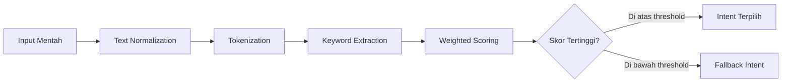
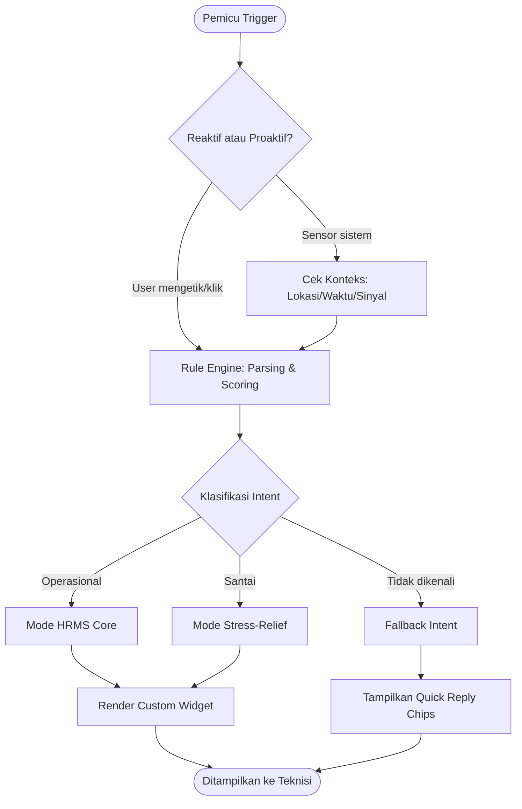

# 🤖 Artacom Bot — Arsitektur & Alur Kerja (Rule-Based System)

**Sistem:** OnTime HRMS v2.0 — Mobile App (Flutter)
**Tipe:** Rule-Based System (RBS) Chatbot — Hybrid Offline-First, Context-Aware, dan Gamified
**Codename Internal:** *Si Rekan Kerja Digital*

> *"Bukan cuma bot absensi — Artacom Bot adalah teman ngobrol teknisi lapangan yang tahu kapan harus serius dan kapan harus becanda."*

---

## 📌 Ringkasan Eksekutif

Artacom Bot dirancang sebagai lapisan interaksi cerdas antara teknisi lapangan dan sistem HRMS inti. Berbeda dari chatbot berbasis NLP/LLM yang bergantung pada server dan koneksi internet stabil, Artacom Bot mengadopsi pendekatan **Rule-Based System (RBS)** murni yang berjalan **on-device**, menjadikannya:

| Keunggulan | Penjelasan |
|---|---|
| ⚡ **Instan** | Tidak ada *round-trip* ke server untuk memahami maksud pengguna → respons dalam hitungan milidetik. |
| 📶 **Tahan Sinyal Lemah** | Cocok untuk teknisi yang bekerja di lokasi terpencil, ruang bawah tanah, atau area minim sinyal. |
| 🔋 **Hemat Kuota & Baterai** | Tidak ada pemrosesan AI berat atau panggilan API berulang. |
| 🎯 **Prediktabel** | Setiap respons bisa diaudit dan diuji karena berbasis aturan tetap, bukan model probabilistik. |
| 🔒 **Privasi Terjaga** | Data mentah ucapan pengguna tidak pernah meninggalkan perangkat untuk keperluan NLP. |

---

## 1. 🎬 Fase Pemicu (Trigger Phase)

Fase ini menentukan bagaimana percakapan antara teknisi lapangan dan Artacom Bot dimulai. Artacom Bot punya "insting" — ia tidak hanya menunggu disapa, tapi juga proaktif membaca konteks di sekitar penggunanya.

### A. 🙋 Pemicu Reaktif (User-Initiated)

| Jenis Pemicu | Deskripsi | Contoh |
|---|---|---|
| **Teks Manual** | Teknisi mengetik bebas melalui *keyboard*. | "aku mau tau sisa cuti dong" |
| **Quick Reply Chips** | Tombol balasan cepat yang selalu menempel di area bawah layar, berubah dinamis sesuai konteks waktu/lokasi. | `[💰 Slip Gaji]` `[🌴 Sisa Cuti]` `[📄 SOP Klaim]` `[🎲 Hiburan]` |
| **Voice-to-Text Shortcut** *(opsional/roadmap)* | Tombol mikrofon untuk *hands-free input* saat tangan teknisi kotor/sibuk di lapangan. | 🎙️ "Bot, absen pulang" |
| **Shake-to-Help** *(easter egg gesture)* | Mengguncangkan HP 3x memunculkan menu bantuan darurat. | Menampilkan kontak HRD & SOP kecelakaan kerja |

### B. 🛰️ Pemicu Proaktif (System-Initiated / Context-Aware)

Artacom Bot "mengintip" tiga sensor utama untuk menjadi asisten yang benar-benar peka konteks:

* **📍 Sensor Lokasi (Geolocator + Geofencing)**
  * Masuk radius kantor/proyek → *"Sudah di area kantor nih, mau absen masuk sekarang?"*
  * Keluar radius proyek tanpa check-out → *"Eh, kamu udah keluar area proyek tapi belum absen pulang. Ketinggalan apa nih?"*

* **⏰ Sensor Waktu (Time-based Trigger)**
  * Pukul 17:00 tanpa check-out → *"Waktunya pulang! Jangan lupa absen biar nggak tercatat lembur otomatis."*
  * Mendekati *deadline* klaim reimbursement (H-1) → *"Reminder: klaim BBM bulan ini ditutup besok jam 23:59 lho!"*
  * Ulang tahun kerja (*work anniversary*) → *"Selamat! Hari ini genap 2 tahun kamu gabung Artacom. 🎉"*

* **📡 Sensor Konektivitas (Offline Resilience)**
  * Sinyal putus saat isi formulir → *"Yah, sinyal putus. Data kilometer awal kamu aku simpan di memori lokal dulu ya."*
  * Sinyal kembali → *"Sinyal balik! Lagi sinkronisasi data kamu yang sempat ketunda… ✅ Selesai, semua aman."*

* **🔋 Sensor Baterai** *(fitur baru)*
  * Baterai < 15% saat masih di lapangan → *"Baterai kamu tinggal 12%. Mau aku aktifkan mode hemat daya biar absen pulang tetap kecatat?"*

* **🌦️ Sensor Cuaca/Kalender** *(fitur baru — integrasi API cuaca lokal)*
  * Prediksi hujan deras di lokasi proyek → *"Kayaknya bakal hujan deras jam 2 siang di lokasi kamu. Jangan lupa bawa jas hujan/APD tambahan ya!"*

---

## 2. ⚙️ Fase Pemrosesan Aturan (Rule Engine & Parsing)

Seluruh pemrosesan teks berjalan **on-device**, tidak pernah dikirim ke *server backend* untuk analisis NLP, menggunakan kombinasi *State Machine*, *Regular Expression* (RegEx), dan *Weighted Keyword Scoring*.



### Tahapan Detail

1. **Text Normalization**
   Mengubah input menjadi huruf kecil dan membuang tanda baca/emoji berlebih.
   `"CAPEK BANGET!! 😩😩"` → `"capek banget"`

2. **Typo Tolerance Layer** *(peningkatan baru)*
   Menggunakan *fuzzy matching* ringan (Levenshtein distance ≤ 2) agar salah ketik umum tetap terbaca.
   `"cutii"`, `"cutu"`, `"cutii dong"` → tetap dikenali sebagai **cuti**

3. **Keyword Extraction & Weighted Scoring**
   Setiap kata kunci punya bobot berbeda agar kalimat ambigu tetap terarah dengan benar.

   | Kata Kunci | Intent Kandidat | Bobot |
   |---|---|---|
   | "gaji" | Payroll | 0.9 |
   | "kapan" | (netral, penguat konteks) | 0.1 |
   | "cair" | Payroll | 0.6 |

   Contoh: *"gaji kapan cair?"* → skor Payroll = 0.9 + 0.1 + 0.6 = **1.6** → intent terpilih.

4. **Context Memory (Short-Term)** *(peningkatan baru)*
   Bot mengingat 1–2 giliran percakapan terakhir agar bisa merespons kalimat lanjutan.
   > Teknisi: "sisa cuti berapa ya"
   > Bot: menampilkan kartu cuti
   > Teknisi: *"ajuin dong"* → tetap dipahami sebagai "ajukan cuti", bukan fallback.

---

## 3. 🧭 Fase Klasifikasi Niat & Routing (Intent Mapping)

Sistem mencabangkan respons ke dalam **dua mode utama** plus satu lapisan darurat.

### 💼 Mode Operasional (HRMS Core)

| Intent | Kata Kunci Pemicu | Aksi Sistem | UI yang Muncul |
|---|---|---|---|
| **Info Cuti/Izin** | "cuti", "sisa cuti", "libur", "izin" | Query SQLite lokal → hitung sisa kuota | `BotLeaveBalanceCard` + progress bar |
| **Penggajian** | "gaji", "slip", "bayaran", "pph" | Ambil status pencairan bulan terakhir | Kartu status + tombol unduh PDF |
| **Bantuan Dokumen (SOP)** | "cara klaim", "sop", "aturan bensin" | Buka *Document Viewer* in-chat | PDF viewer embedded |
| **Operasional Kendaraan (Fleet)** | "berangkat", "pulang", "kilometer" | Trigger kamera untuk foto odometer | Kamera + form validasi otomatis |
| **Lembur & Approval** *(baru)* | "lembur", "approve", "acc atasan" | Cek status pengajuan lembur real-time (via cache lokal tersinkron) | `BotApprovalStatusCard` dengan status: ⏳ Menunggu / ✅ Disetujui / ❌ Ditolak |
| **Target & Kinerja** *(baru)* | "target bulan ini", "skor", "performa" | Menampilkan progres KPI ringkas | `BotPerformanceGauge` (gauge chart) |
| **Darurat K3** *(baru)* | "kecelakaan", "cedera", "darurat" | Prioritas tertinggi — langsung tampilkan kontak darurat & lokasi klinik terdekat | `BotEmergencyCard` (mode merah, bypass semua rule lain) |

### 🎮 Mode Santai (Stress-Relief & Easter Eggs)

Mode ini adalah "jiwa" dari Artacom Bot — yang membedakannya dari HRMS app biasa yang kaku dan membosankan.

| Intent | Kata Kunci / Kondisi | Aksi |
|---|---|---|
| **Keluhan Lelah** | "capek", "lelah", "pusing", "mumet" | Meme kucing + *"Kerja, kerja, kerja, tipes. Istirahat 5 menit dulu bos, minum air putih sana!"* |
| **Sarkasme Waktu (Night Owl)** | Pesan terkirim 23:00–04:00 di luar shift | *"Tidur bos. Kamera pendeteksi wajah besok pagi bisa gagal nge-scan kalau mukamu kurang tidur."* |
| **Mini Games** | "/tebak", "main", "bosan" | `startRiddleGame()` — teka-teki/jokes garing acak |
| **Streak Semangat** *(baru — gamifikasi)* | Absen tepat waktu 5 hari berturut-turut | *"Wih, 5 hari on-time beruntun! 🔥 Kamu dapat badge 'Si Rajin'."* + notifikasi *leaderboard* tim |
| **Curhat Ringan** *(baru)* | "bete", "bosen banget", "males kerja" | Respons empatik ringan + tautan opsional ke *wellness tips* singkat (bukan pengganti konseling profesional) |
| **Random Fun Fact** *(baru)* | "fakta", "kasih tau sesuatu" | Menampilkan 1 fakta unik seputar dunia teknisi/telekomunikasi setiap hari |
| **Anniversary & Ulang Tahun** *(baru)* | Terpicu otomatis dari data HR | Kartu ucapan animasi confetti 🎉 |

### ❓ Fallback Intent (Tidak Dikenali)

Ketika tidak ada kata kunci cocok atau skor di bawah *threshold*:

> *"Waduh, Artacom Bot kurang paham nih. Maksudnya mau cek operasional atau butuh hiburan?"*

Disertai **Quick Reply Chips** pemandu ulang, dan — sebagai peningkatan — sistem mencatat *(secara anonim & lokal)* frasa yang gagal dikenali agar tim produk bisa menambah kamus kata kunci di update berikutnya (*"self-improving dictionary"* tanpa perlu AI/NLP server-side).

---

## 4. 🖼️ Fase Pembangunan Antarmuka (Rich UI Rendering)

Bot menerjemahkan niat menjadi objek respons JSON (State), lalu Flutter merender *Custom Widget* sesuai tipe UI-nya — lengkap dengan **mood system** agar avatar bot terasa hidup.

### 🎭 Sistem Mood Avatar *(peningkatan baru)*

| Mood | Kapan Muncul | Ekspresi Avatar |
|---|---|---|
| `happy` | Info positif (cuti tersedia, gaji cair) | 😊 Senyum + confetti kecil |
| `neutral` | Info standar/dokumen | 🙂 Netral |
| `concerned` | Kuota cuti hampir habis, baterai lemah | 😟 Sedikit khawatir |
| `sleepy` | Chat di jam malam (mode sarkasme) | 😴 Menguap |
| `excited` | Streak/badge/pencapaian | 🤩 Melompat kecil |
| `urgent` | Mode darurat K3 | 🚨 Serius, warna UI merah |

### Contoh Struktur Logika Internal JSON

```json
{
  "bot_mood": "happy",
  "message": "Sisa cuti kamu tinggal 3 hari nih untuk tahun ini.",
  "ui_component": "BotLeaveBalanceCard",
  "data_payload": {
    "total": 12,
    "used": 9,
    "remaining": 3
  },
  "action_buttons": [
    { "label": "Ajukan Cuti Sekarang", "action_code": "NAV_LEAVE_FORM" },
    { "label": "Tanya Aturan Cuti", "action_code": "FETCH_SOP_LEAVE" }
  ],
  "media_url": null,
  "context_memory": {
    "last_intent": "leave_balance_inquiry",
    "expires_in_turns": 2
  }
}
```

### Contoh Tambahan — Mode Gamifikasi

```json
{
  "bot_mood": "excited",
  "message": "5 hari on-time beruntun! Kamu dapat badge baru 🏅",
  "ui_component": "BotStreakBadgeCard",
  "data_payload": {
    "streak_days": 5,
    "badge_name": "Si Rajin",
    "leaderboard_rank": 3
  },
  "action_buttons": [
    { "label": "Lihat Leaderboard Tim", "action_code": "NAV_LEADERBOARD" }
  ],
  "media_url": "assets/badges/si_rajin.png"
}
```

---

## 5. 🗺️ Diagram Alur Sistem Menyeluruh



---

## 6. 🚀 Roadmap Pengembangan Lanjutan (Saran)

| Prioritas | Fitur | Manfaat |
|---|---|---|
| 🔴 Tinggi | Mode Darurat K3 dengan bypass rule | Keselamatan kerja teknisi lapangan |
| 🟠 Sedang | Context Memory 2–3 giliran | Percakapan terasa lebih natural |
| 🟠 Sedang | Sistem Badge & Leaderboard Tim | Meningkatkan motivasi & retensi |
| 🟡 Rendah | Voice-to-Text shortcut | Aksesibilitas saat tangan kotor/sibuk |
| 🟡 Rendah | Fun Fact harian | Engagement ringan, tidak mengganggu kerja |
| 🟢 Riset | Migrasi bertahap ke Hybrid RBS+NLP ringan on-device (mis. TFLite intent classifier kecil) | Menangani variasi bahasa yang lebih luas tanpa kehilangan sifat offline-first |

---

## 7. 📎 Catatan Teknis Implementasi

* **Local Storage:** SQLite untuk data terstruktur (cuti, gaji, approval), *Shared Preferences* untuk state ringan (mood terakhir, streak counter).
* **Sinkronisasi:** Menggunakan *background sync queue* — setiap aksi offline disimpan ke antrean lokal dan dikirim otomatis saat koneksi pulih, dengan mekanisme *retry* dan notifikasi status ke pengguna.
* **Keamanan:** Data sensitif (slip gaji, foto odometer) tetap terenkripsi di penyimpanan lokal sebelum sinkronisasi ke server.
* **Skalabilitas Kamus Kata Kunci:** Disimpan dalam format JSON terpisah dari kode aplikasi agar tim non-developer (HR/Ops) bisa menambah *keyword* baru lewat *config* tanpa perlu rilis ulang aplikasi.

---

*Dokumen ini adalah versi pengembangan dari arsitektur awal Artacom Bot — ditambahkan lapisan gamifikasi, sensor konteks baru, sistem mood, dan diagram alur untuk memudahkan tim engineering & product dalam implementasi maupun presentasi ke stakeholder.*
